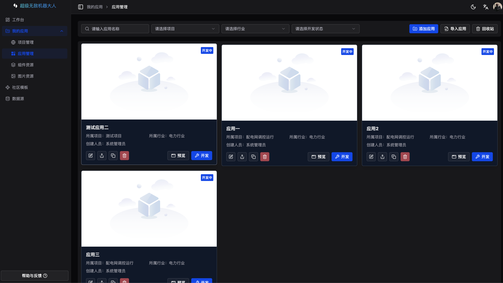
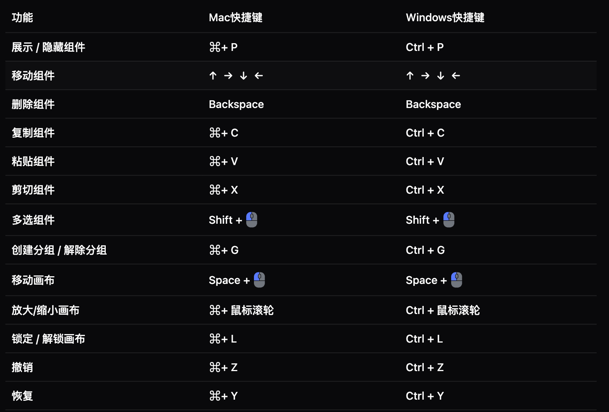

<h2 align="center">
Monster 开源、精美、便捷的「数据可视化」低代码开发平台
</h2>

#### 😶 **前端** 分支： **`master`**

#### 📚 预览地址：[https://heartmm.xyz/](https://heartmm.xyz/)

#### 🤯 后端项目看这里!

后端地址（社区实现，仅供参考）：

- `基于nestjs编写` [https://github.com/Lililili-li/low-code-backend](https://github.com/Lililili-li/low-code-backend)

#### 整体介绍

- 框架：基于 `React19版本` 框架编写，使用 `hooks` 写法抽离部分逻辑，使代码结构更加清晰；

- 类型：使用 `TypeScript` 进行类型约束，减少未知错误发生概率，可以大胆修改逻辑内容；

- 性能：多处性能优化，使用页面懒加载、组件动态注册、数据滚动加载等方式，提升页面渲染速度；

- 存储：拥有本地记忆，部分配置项采用 `storage` 存储本地，提升使用体验；

- 封装：项目进行了详细的工具类封装如：路由、存储、加/解密、文件处理、主题、NaiveUI 全局方法、组件等

- 可视化：基于开源图表库[ECharts](https://echarts.apache.org/zh/index.html) 编写，具有丰富的图表类型；

#### 应用管理：

<!-- 主题色：

亮白主题：
 -->

主要技术栈为：

| 名称                 | 版本   | 名称        | 版本     |
| -------------------- | ------ | ----------- | -------- |
| react                | 19.1.x | TypeScript5 | 5.9.x    |
| Vite                 | 4.2.x  | Shadcn UI   | 最新版本 |
| ECharts              | 5.3.x  | Zustand     | 5.0.x    |
| turborepo + monorepo | 😁     | 🥰          | 🤗       |
| 详见 `package.json`  | 😁     | 🥰          | 🤗       |

开发环境:

| 名称 | 版本    | 名称    | 版本   |
| ---- | ------- | ------- | ------ |
| node | 18.20.x | npm     | 10.7.x |
| pnpm | 8.6.7   | windows | 11     |

已完成图表：

| 分类   | 名称             | 名称       | 名称           | 名称                     |
| ------ | ---------------- | ---------- | -------------- | ------------------------ |
| 图表   | 柱状图           | 横向柱状图 | 折线图         | 单/多 折线面积图(渐变色) |
| \*     | 饼图             | 环形图     | 水球图         | 雷达图                   |
| \*     | NaiveUI 多种进度 | 散点图     | 对数回归散点图 | 热力图                   |
| \*     | 漏斗图           | 中国地图   | 高德地图       | 🦊                       |
| 信息   | 文字             | 渐变文字   | 词云           | 嵌套网页                 |
| \*     | 图片             | 视频       | 😺             | 🐯                       |
| 列表   | 滚动排名列表     | 滚动表格   | 🐮             | 🐐                       |
| 小组件 | 边框-01~13       | 装饰-01~05 | 数字翻牌       | 通用时间                 |
| \*     | 数字计数         | 倒计时     | 时钟           | 🦁                       |

# 功能点整理

## 中央画布模块

<h4 >
  已完成功能：
</h4>

#### 1.画布滚轮缩放
#### 2.画布正常缩放
#### 3.画布动态渲染组件
#### 4.鼠标拖拽移动画布
#### 5.鼠标拖拽移动组件以及组件的尺寸
#### 6.组件拖拽时显示辅助线，自动吸附定位到同一水平线组件

### 快捷键模块（支持Mac系统以及windows系统）
<h4 >
  已完成功能：
</h4>

## 操作记录模块

<h4 >
  已完成功能：
</h4>

#### 1.组件移动
#### 2.组件尺寸修改
#### 3.组件分组拆分
#### 4.组件复制、粘贴、剪切
#### 5.组件锁定
#### 6.组件新增
#### 7.组件删除
#### 8.清空操作记录
#### 9.回退到某个记录

## 物料管理模块

<h4 >
  已完成功能：
</h4>

#### 1.组件配置导出
#### 2.组件实例渲染
#### 3.组件配置项修改
## 浏览器支持

开发和测试平台均在 `Google` 和最新版 `EDGE` 上完成，暂未测试 `IE11` 等其它浏览器，如有需求请自行测试与兼容。

## 代码提交

- feat: 新功能
- fix: 修复 Bug
- docs: 文档修改
- perf: 性能优化
- revert: 版本回退
- ci: CICD 集成相关
- test: 添加测试代码
- refactor: 代码重构
- build: 影响项目构建或依赖修改
- style: 不影响程序逻辑的代码修改
- chore: 不属于以上类型的其他类型(日常事务)
